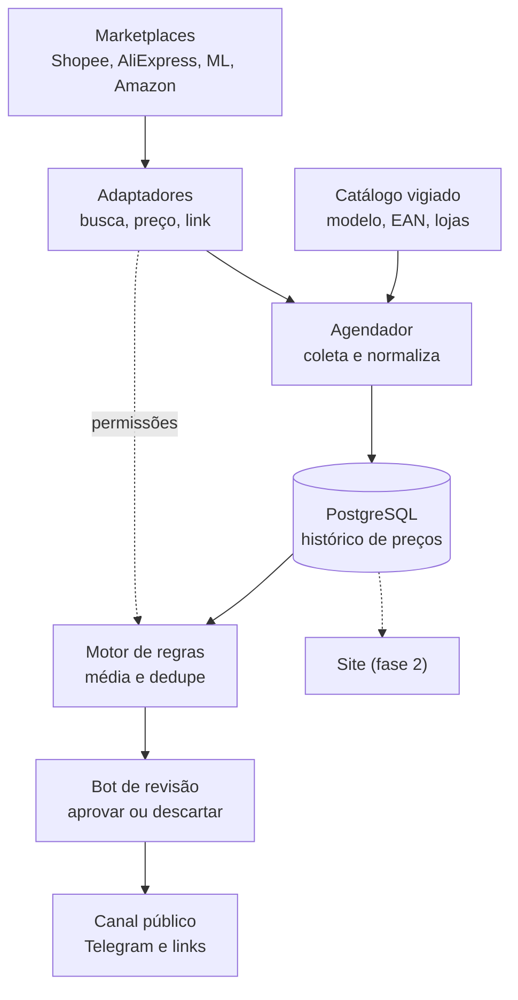

# Pulso Promos — Especificação de requisitos

Sep 21, 2026 · @Someone

## Visão geral

O Pulso Promos é um canal público de promoções de relógios no Telegram, alimentado por uma plataforma que vigia preços em marketplaces e só publica o que passa por regras e por revisão humana.

A receita vem da comissão de afiliado que os marketplaces pagam quando um leitor compra pelo link publicado. O domínio pulsopromos.com.br foi informado como livre pelo responsável e ainda precisa ser registrado.

Princípios do projeto:

- Os alertas se baseiam no histórico próprio de preços, não no preço “de” que a loja exibe.
- Nada é publicado sem aprovação de uma pessoa, pelo menos no MVP.
- Todo link é direto do marketplace, sem encurtador próprio.
- Não há IA: o casamento de produtos vem de um catálogo mantido à mão.
- Cada marketplace fica atrás de um adaptador com as suas próprias permissões.

## Decisões de escopo

O escopo está fechado em sete decisões, todas tomadas na fase de desenho e listadas com o motivo de cada uma.

| Decisão | Escolha | Motivo |
| --- | --- | --- |
| Fonte de links | Marketplaces grandes (Shopee, AliExpress, Mercado Livre, Amazon), sem redes de afiliados | Confiança do público nas lojas |
| Ordem de entrada | Shopee, AliExpress, Mercado Livre, Amazon (proposta) | Shopee e AliExpress têm API de afiliado; a Amazon depende de aprovação |
| IA | Não usada | Casamento de produtos resolvido pelo catálogo vigiado, com referência do fabricante e EAN |
| Publicação | Revisão humana obrigatória no MVP | Evitar oferta errada, cupom vencido ou vendedor duvidoso |
| Links | Diretos, sem encurtador próprio | O Mercado Livre proíbe encurtadores externos e a Amazon exige link claro |
| Nicho | Relógios | Demanda pedida em comunidades e poucos canais dedicados nas buscas feitas |
| Canal | Telegram público; site na fase 2 | Menor esforço para começar |

## Arquitetura e fluxo

Os dados vão dos marketplaces até o canal em seis etapas, e nenhuma oferta chega ao público sem passar pela regra e pela revisão.

O catálogo define o que o agendador coleta. Os adaptadores informam ao motor de regras o que cada marketplace permite, e os relatórios de conversão voltam pelo mesmo caminho, dos adaptadores ao banco.

### Produto e Publicação

São duas entidades diferentes, não uma só, e isso muda o modelo de dados.

|  | Produto | Publicação |
| --- | --- | --- |
| O que é | O relógio do catálogo (RF01) | Um post específico: aquele preço, aquela loja, aquele momento |
| Quantos existem | Um por relógio | Vários por relógio, um a cada vez que ele é publicado de novo |
| Preço mostrado | O mais barato atual, entre todas as lojas | O preço daquele momento, mesmo que hoje já tenha mudado |
| Tela correspondente | Produto — detalhe (RF36) | Publicação — detalhe (RF45) |

A publicação nasce no momento do RF19/RF20 (aprovar e publicar) e alimenta, ao mesmo tempo, o canal do Telegram (RF22) e o feed do site (RF44) — é o mesmo registro, não dois publicados separadamente. O banco de dados precisa de uma tabela própria de publicações, referenciando o relógio, o anúncio que gerou o post e o cupom usado (se houve), separada da tabela de histórico de preços.

## Requisitos funcionais

A plataforma tem 52 requisitos funcionais: 28 no MVP, 23 na fase 2 e 1 como ideia futura fora de escopo por ora (RF41). Os requisitos RF06, RF11 e RF17 dependem dos termos de cada marketplace, tratados na seção de regras e conformidade.

| ID | Módulo | Requisito | Fase |
| --- | --- | --- | --- |
| RF01 | Catálogo | Cadastrar relógio com marca, referência do fabricante, EAN (obrigatório e único — chave natural do relógio), tipo de movimento (automático, quartzo, manual, solar, híbrido) e tamanho da caixa | MVP |
| RF02 | Catálogo | Vincular ao relógio um ou mais anúncios (marketplace e ID ou URL) | MVP |
| RF03 | Catálogo | Pausar a vigilância, definir preço-alvo, exigir loja oficial ou reputação mínima do vendedor, e importar e exportar o catálogo em CSV | MVP |
| RF04 | Adaptadores | Consultar preço, estoque e vendedor de um anúncio por uma interface comum a todos os marketplaces | MVP |
| RF05 | Adaptadores | Gerar link de afiliado e obter o relatório de conversões de cada marketplace | MVP |
| RF06 | Adaptadores | Declarar as permissões de cada marketplace (guardar histórico, alertar preço, canais e avisos exigidos) e obedecê-las | MVP |
| RF07 | Adaptadores | Tratar limites de chamadas, erros e renovação de credenciais sem parar os outros adaptadores, marcando como desatualizado o dado de quem falhou | MVP |
| RF08 | Adaptadores | Buscar por palavra-chave para achar candidatos ao catálogo | Fase 2 |
| RF09 | Coleta | Coletar preços do catálogo em intervalos configuráveis por marketplace | MVP |
| RF10 | Coleta | Normalizar preço à vista, parcelado, frete, estoque, vendedor e cupom aplicável | MVP |
| RF11 | Histórico | Guardar cada mudança de preço com data e hora, conforme a permissão do adaptador | MVP |
| RF12 | Histórico | Calcular a média de 30 dias e o menor preço de 90 dias de cada relógio | MVP |
| RF13 | Cupons | Cadastrar cupons (código, loja, regra, validade) e registrar quando foram testados | MVP |
| RF14 | Regras | Calcular o preço efetivo (preço menos cupom mais frete) | MVP |
| RF15 | Regras | Gerar candidatos a alerta por queda contra a média, menor preço em 90 dias ou preço-alvo, com limiares por faixa de preço | MVP |
| RF16 | Regras | Não repetir o alerta do mesmo relógio em 24 horas, salvo se o preço cair mais | MVP |
| RF17 | Regras | Descartar candidato sem estoque, de vendedor não confiável ou de adaptador sem permissão de alerta | MVP |
| RF18 | Regras | Ordenar os candidatos por pontuação | MVP |
| RF19 | Revisão | Enviar cada candidato ao operador no Telegram com preço, comparação, cupom e link | MVP |
| RF20 | Revisão | Aprovar, descartar ou editar o texto antes de publicar | MVP |
| RF21 | Revisão | Publicar sozinho as ofertas de pontuação alta, se o operador ativar | Fase 2 |
| RF22 | Publicação | Publicar no canal título, preço, comparação com a média, cupom, loja e link, respeitando os limites de envio do Telegram | MVP |
| RF23 | Publicação | Gerar o link na hora de publicar, direto, sem encurtador próprio, com identificador por post quando a plataforma permitir | MVP |
| RF24 | Publicação | Incluir o aviso de afiliado e o de que preço e cupom podem mudar, com carimbo de data e hora quando o marketplace exigir | MVP |
| RF25 | Publicação | Editar ou encerrar o post quando o preço subir, o estoque acabar ou a promoção terminar | MVP |
| RF26 | Medição | Importar cliques, vendas e comissões dos relatórios de cada plataforma e relacionar ao post | MVP |
| RF27 | Medição | Relatório por marketplace, faixa de preço, relógio e regra de alerta | Fase 2 |
| RF28 | Administração | Login do operador com papéis de administrador e revisor | MVP |
| RF29 | Administração | Configurar intervalos, limiares e permissões sem alterar o código | MVP |
| RF30 | Administração | Registrar em auditoria quem aprovou cada post, com os valores e o link usados | MVP |
| RF31 | Administração | Avisar o operador sobre falha de coleta, credencial vencida ou comissão zerada | MVP |
| RF32 | Site | Site público em pulsopromos.com.br com ofertas e histórico de preço, conforme as permissões de cada marketplace | Fase 2 |
| RF33 | Usuários | Leitores criarem alertas próprios por relógio e preço no bot | Fase 2 |
| RF34 | Usuários | Conta de leitor no site público, opcional para navegar, ver ofertas e abrir a página de detalhe (RF36); exigida só para favoritar (RF39) e para o perfil (RF35). Cadastro próprio da plataforma (e-mail e senha) ou login pela Conta do Google (OAuth), à escolha do leitor; separado do login do operador (RF28) | Fase 2 |
| RF35 | Usuários | Depois de logado, um avatar circular com a foto do leitor aparece no canto superior direito do site; ao clicar, abre um menu suspenso com duas opções: Perfil e Favoritos | Fase 2 |
| RF36 | Site | Cada relógio do catálogo público tem uma página de detalhe própria, com imagem, especificações, histórico de preço, prós e contras, e botão de favoritar | Fase 2 |
| RF37 | Site | A página de detalhe traz o botão "Acessar oferta", com o link de afiliado gerado na hora (RF23) | Fase 2 |
| RF38 | Site | Clicar em um relógio na listagem principal ou na lista de favoritos abre a sua página de detalhe | Fase 2 |
| RF39 | Usuários | Leitor favorita ou desfavorita um relógio a partir da página de detalhe; sem estar logado, o clique leva ao cadastro ou login (RF34) antes de favoritar | Fase 2 |
| RF40 | Usuários | Aba de favoritos no perfil lista os relógios favoritados pelo leitor; o card inteiro é clicável, sem botão separado, e leva à sua página de detalhe | Fase 2 |
| RF41 | Site | Vídeo explicativo do relógio na página de detalhe, com link para um conteúdo já existente na internet (não produzido pela Pulso Promos) | Futuro |
| RF42 | Catálogo | Operador cadastra e edita, por relógio, a descrição, os prós e os contras exibidos na página pública | Fase 2 |
| RF43 | Site | Na página de detalhe, a lista de outras lojas que vendem o relógio ocupa a mesma altura do gráfico de histórico, ao lado dele; se não couberem todas, a lista rola por dentro dela mesma, sem esticar a página. A loja de menor preço aparece destacada visualmente (contorno e selo) nessa lista | Fase 2 |
| RF44 | Site | O feed principal do site mostra publicações, não o catálogo direto: cada card é uma publicação (RF22), com o preço, a loja e o cupom daquele momento, ordenadas da mais recente para a mais antiga; por ora, sem nenhuma métrica de desconto (percentual sobre a média, "menor preço em X dias" etc.) exibida nos cards | Fase 2 |
| RF45 | Site | Clicar em um card do feed abre a página de Publicação — detalhe: os mesmos elementos da página de relógio (RF36), mas presos ao preço, à loja e ao cupom daquela publicação específica, não ao preço atual | Fase 2 |
| RF46 | Site | A página de Publicação — detalhe tem, abaixo do botão "Acessar", o botão "Visualizar produto", que leva à página de Produto — detalhe (RF36), com o preço mais barato atual entre todas as lojas | Fase 2 |
| RF47 | Site | O gráfico de histórico de preço mostra duas linhas, preço à vista e preço parcelado, no mesmo eixo, com legenda indicando qual cor é qual | Fase 2 |
| RF48 | Site | O gráfico tem um filtro de período (1 ano, 6 meses, 3 meses ou 30 dias) que recalcula as linhas e o eixo de datas sem recarregar a página | Fase 2 |
| RF49 | Site | Acima do gráfico, um indicador mostra a variação percentual do preço à vista e do parcelado no período do filtro selecionado, comparando o primeiro e o último valor da janela | Fase 2 |
| RF50 | Site | Na página de detalhe (Produto ou Publicação), dois botões alternam qual preço aparece em destaque: à vista, ou parcelado com o total e o número de parcelas | Fase 2 |
| RF51 | Site | O botão de cupom só aparece na página de detalhe quando o relógio tem cupom cadastrado; quando não há, nenhum espaço fica reservado no lugar | Fase 2 |
| RF52 | Usuários | Antes de levar ao cadastro ou login (RF39), o clique em favoritar sem estar logado mostra um modal explicando o benefício da lista de favoritos, com um botão para entrar agora e outro para deixar para depois | Fase 2 |

## Requisitos não funcionais

Os requisitos não funcionais fixam segurança, conformidade e operação. Os números marcados como proposta são metas iniciais, a serem revistas com os primeiros dados de uso.

| ID | Categoria | Requisito |
| --- | --- | --- |
| RNF01 | Segurança | Segredos (App Secret, tokens e chaves) ficam em variáveis de ambiente ou cofre, nunca no repositório |
| RNF02 | Segurança | O operador entra com autenticação em dois fatores e papéis; o bot de revisão só responde a IDs do Telegram autorizados |
| RNF03 | Conformidade | Todo post e toda página trazem o aviso de afiliado; os termos de cada marketplace ficam codificados como permissões do adaptador |
| RNF04 | Conformidade | Dados pessoais de leitores, na fase 2, seguem a LGPD com coleta mínima |
| RNF05 | Desempenho | Proposta: catálogo inicial de até 500 relógios, coletados a cada 30 a 60 minutos, dentro dos limites de chamadas de cada API |
| RNF06 | Desempenho | Proposta: um candidato chega à revisão em até 15 minutos após a coleta que o gerou |
| RNF07 | Disponibilidade | A falha de um adaptador não interrompe os demais; proposta de meta inicial de 95% de coletas bem-sucedidas por dia em cada marketplace |
| RNF08 | Confiabilidade | As operações são idempotentes: a mesma oferta nunca é publicada duas vezes e uma coleta repetida não duplica leituras |
| RNF09 | Integridade | Todo preço guarda origem, data e hora; dado desatualizado é marcado e não gera alerta |
| RNF10 | Manutenção | Um adaptador por marketplace, testável sozinho com respostas gravadas; trocar ou remover um marketplace não altera o núcleo |
| RNF11 | Observabilidade | Logs estruturados, registro de erros e aviso ao operador em falhas (RF31) |
| RNF12 | Auditoria | Aprovações e edições ficam guardadas por pelo menos 12 meses (proposta) |
| RNF13 | Portabilidade | Execução em contêineres, com implantação repetível em um servidor pequeno |
| RNF14 | Custo | Operar em servidor de baixo custo, sem serviços pagos por chamada de IA |
| RNF15 | Usabilidade | O operador aprova ou descarta uma oferta em até dois toques no bot (proposta) |
| RNF16 | Extensibilidade | Adicionar um marketplace exige apenas um novo adaptador e suas permissões |

## Regras e conformidade por marketplace

A Amazon é o marketplace mais restrito: alerta de preço e histórico exigem aprovação. Nos outros três, ainda falta ler o que os termos dizem sobre guardar histórico de preços.

| Marketplace | O que sabemos | A verificar |
| --- | --- | --- |
| Shopee | API de afiliados com busca de produtos, links curtos com sub-IDs, relatório de conversões e feeds de catálogo, segundo ferramentas de terceiros; credenciais no painel do afiliado; Telegram e WhatsApp são incentivados; são proibidos anúncios pagos por palavra-chave, sites impróprios, fraude e e-mail publicitário sem consentimento | Documentação oficial da API; termos sobre guardar histórico; comissão atual (um guia cita 1% a 10%; no lançamento, em 2021, era de até 14%) |
| AliExpress | Programa Portals com API de link, detalhe de produto, produtos em alta e pedidos, com assinatura HMAC; guias de terceiros citam comissão de 3% a 9%, cookie de 3 dias e taxa fixa de US$ 15 por saque | Comissão, cookie e taxa no portal oficial; termos sobre armazenar preços |
| Mercado Livre | A página do programa cita WhatsApp e Telegram como canais; a documentação de desenvolvedor tem endpoint de preços e busca com token; uma pesquisa anterior indicou comissão de até 16% por categoria, cookie de 24 horas, proibição de encurtadores externos e de anúncios pagos em buscadores, e ausência de API pública para gerar link de afiliado | Se uma conta de afiliado, sem ser vendedor, acessa a API de dados; termos sobre histórico; confirmar nos termos oficiais as regras da pesquisa anterior |
| Amazon | Regras restritivas para alerta de preço e histórico, detalhadas abaixo; a Creators API exige conta de Associados e 10 vendas qualificadas nos últimos 30 dias | Se a Amazon aprova um canal de alertas de preço; se um canal público de Telegram cumpre a definição de site do programa |

Regras da Amazon que afetam o projeto, lidas por inteiro nas políticas de 14/04/2026:

- Sem aprovação da Amazon, o site não pode ter recurso de rastreamento ou alerta de preços.
- Conteúdo da API que não é imagem pode ficar em cache por até 24 horas; imagens não podem ser guardadas; o ASIN pode ser guardado sem prazo.
- Agregar, analisar ou extrair conteúdo da API exige aprovação prévia por escrito.
- É proibido modificar o conteúdo do programa ou usá-lo para treinar modelos de aprendizado de máquina.
- Todo preço exibido leva carimbo de data e hora e aviso de que pode mudar.
- A declaração de participante do programa é obrigatória, e não pode haver encurtador que esconda o destino do link.
- Links em mensagens só valem se o destinatário os solicitou, e o site precisa ser público e ter conteúdo original.

Fontes, com o que foi lido por inteiro e o que foi visto só em trecho de busca (consulta em 21/09/2026):

- [Amazon, Contrato Operacional do Programa de Associados](https://associados.amazon.com.br/help/operating/agreement) (lido por inteiro)
- [Amazon, Políticas do Programa de Associados](https://associados.amazon.com.br/help/operating/policies/) (lido por inteiro)
- [Amazon, Creators API](https://affiliate-program.amazon.com/creatorsapi/docs/en-us/introduction) (trecho de busca)
- [Shopee, blog do programa de afiliados](https://shopee.com.br/blog/programa-de-afiliados-shopee/) (trecho de busca)
- [Tecnoblog, lançamento do programa da Shopee em 2021](https://tecnoblog.net/477797/exclusivo-shopee-lanca-programa-de-afiliados-no-brasil-com-comissoes-de-ate-14/) (trecho de busca)
- [Ecommerce na Prática, afiliados do AliExpress](https://ecommercenapratica.com/blog/afiliados-aliexpress/) (trecho de busca)
- [Mercado Livre, página do programa de afiliados](https://www.mercadolivre.com.br/l/afiliados-aproveite-o-programa) (trecho de busca)
- [Mercado Livre, documentação da API de preços](https://developers.mercadolivre.com.br/pt-br/api-de-precos) (trecho de busca)

## Fases e critérios de aceite

O MVP entrega o fluxo completo com a Shopee, do catálogo ao post aprovado com link de afiliado. Os outros marketplaces entram um a um, cada um só depois de cumprir as pré-condições da tabela.

| Fase | Entrega | Pré-condição | Critério de aceite |
| --- | --- | --- | --- |
| MVP com Shopee | Catálogo, adaptador Shopee, coleta, histórico, regras, bot de revisão, publicação e medição | Cadastro no programa de afiliados e credenciais da API | Um relógio cadastrado é coletado, gera candidato, é aprovado no bot e publicado com link de afiliado e aviso; a conversão aparece no relatório importado |
| AliExpress | Adaptador e permissões do AliExpress | Cadastro no Portals e aplicação aprovada | O mesmo fluxo funciona com link e relatório do AliExpress |
| Mercado Livre | Adaptador e permissões do Mercado Livre | Leitura dos termos e confirmação de acesso à API de dados e ao link | O mesmo fluxo funciona respeitando as regras de link e de canal |
| Amazon | Adaptador com histórico e alerta desligados até a aprovação | Aprovação da Amazon por escrito e, para a API, 10 vendas qualificadas em 30 dias | A aprovação está anexada ao projeto e as permissões do adaptador refletem o que ela autoriza |
| Fase 2 | Site, relatórios, alertas de leitores, publicação automática, busca por palavra-chave, perfil do leitor, favoritos, feed de publicações e páginas de detalhe do relógio e da publicação | MVP estável e comissão medida | Requisitos RF08, RF21, RF27 e RF32 a RF40 atendidos, mais RF42 e RF44 a RF52; RF41 (o vídeo) fica para uma etapa futura, fora de escopo por ora |

## Riscos e pontos em aberto

Os dois pontos que mais podem mudar o projeto são os termos de guardar histórico de preços e a aprovação da Amazon. Os demais são verificações de cadastro, marca e comissão.

| Ponto | Impacto | Próximo passo |
| --- | --- | --- |
| Termos de Shopee, AliExpress e Mercado Livre sobre guardar histórico de preços não foram lidos | Podem limitar RF11 e RF12 | Ler os termos antes de fechar o modelo de dados |
| Aprovação da Amazon para alerta de preço | Bloqueia histórico e alerta na Amazon | Pedir aprovação por escrito pelo canal “Fale conosco” do portal de Associados |
| Relógios falsificados em anúncios de marketplaces | Risco à reputação do canal | Aplicar RF03 (loja oficial ou reputação mínima) e manter a revisão humana |
| Comissão real por marketplace e por relógio é desconhecida | Define se o canal compensa | Conferir nos painéis, começando pela Shopee |
| Nome e marca: o domínio foi informado como livre, mas eu não o verifiquei; o usuário do Telegram e a consulta no INPI estão pendentes | Risco de perder o nome ou de conflito de marca | Registrar o domínio, reservar o usuário e consultar o INPI |
| Creators API da Amazon exige 10 vendas qualificadas em 30 dias | Sem API no começo | Usar links manuais até atingir o volume |
| Detalhes da API da Shopee vêm de ferramentas de terceiros | Contrato da API pode diferir | Confirmar na documentação oficial antes de codificar |
| Enquadramento fiscal e tipo de cadastro nos programas (pessoa física ou empresa) não foram verificados | Pode afetar o recebimento das comissões | Confirmar com um contador e nas regras de cada programa |
| APIs e termos mudam, como a troca da API da Amazon em 2026 | Retrabalho nos adaptadores | Manter os adaptadores isolados (RNF10) |
| Login pelo Google (OAuth) exige criar credenciais no Google Cloud Console e configurar o domínio autorizado | Bloqueia o RF34 até estar configurado | Criar o projeto no Google Cloud Console, gerar client ID e secret, e registrar pulsopromos.com.br como origem autorizada |
| Direitos de uso de vídeos de terceiros no RF41 (por exemplo, incorporar um vídeo do YouTube) não foram verificados | Pode impedir ou limitar a exibição do vídeo | Confirmar se a incorporação pelo player oficial da plataforma de vídeo é permitida, em vez de hospedar o vídeo |
| Prós, contras e descrição de cada relógio (RF42) exigem tempo de redação do operador | Pode atrasar a publicação de novos relógios no site | Avaliar um texto-modelo preenchido à mão a partir das especificações do catálogo, sem IA |
